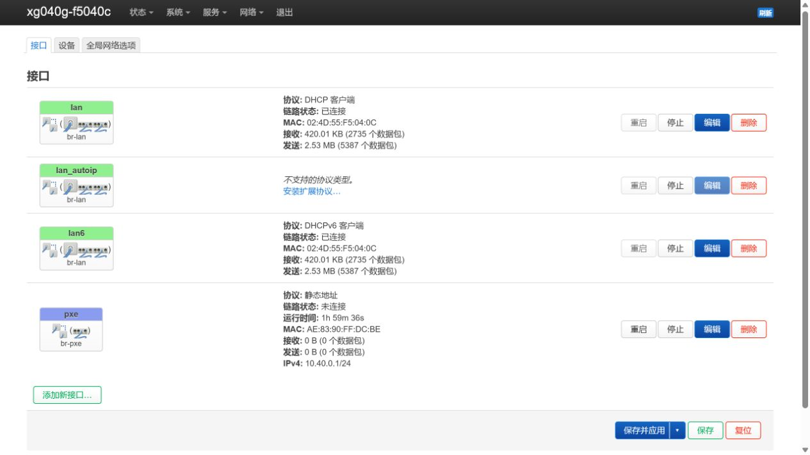
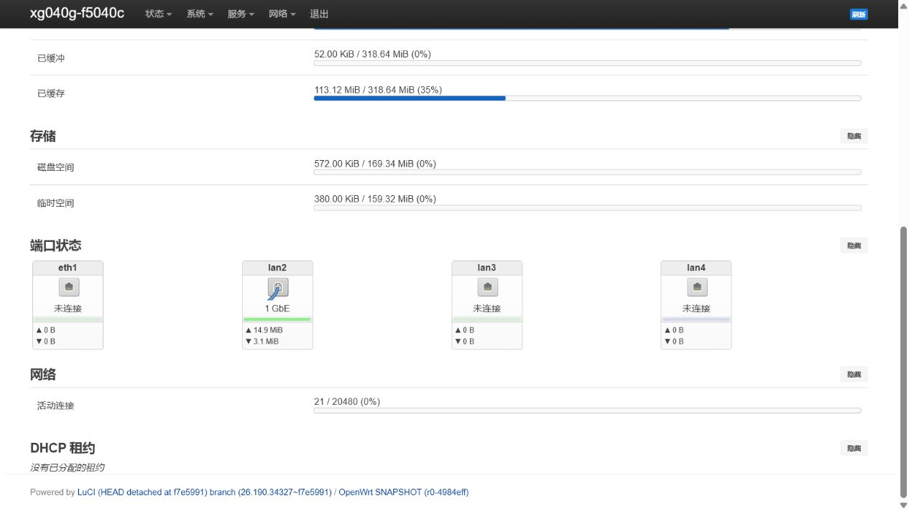
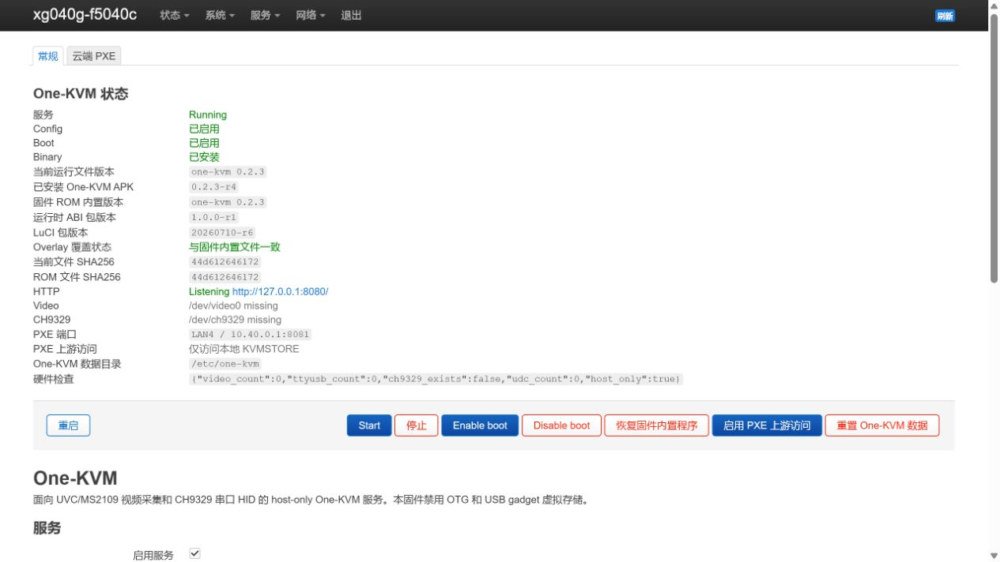
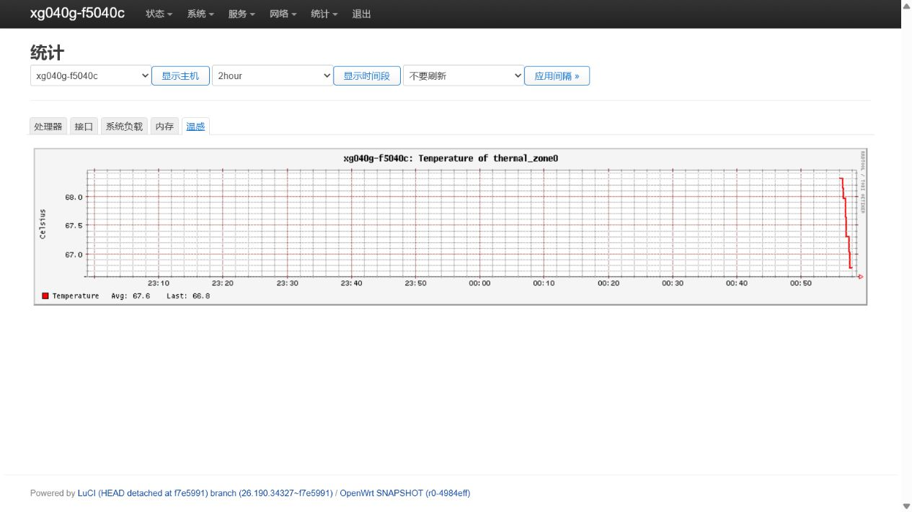
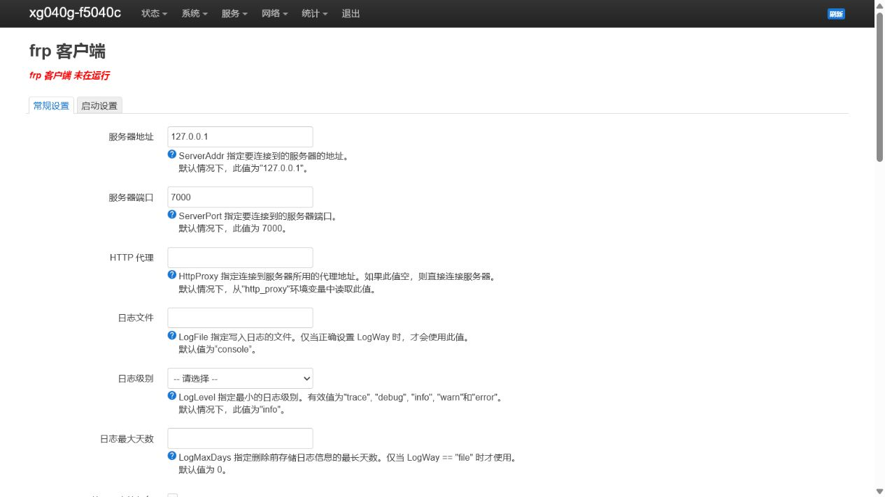
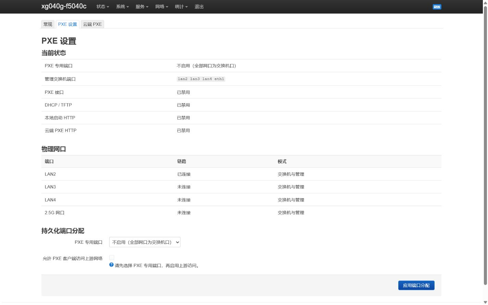
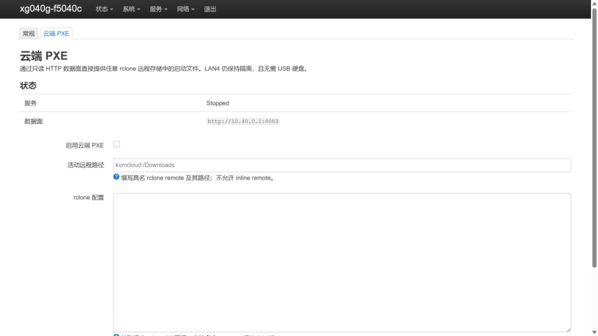

# XG-040G-MD OpenWrt One-KVM

[](https://github.com/Ljzd-PRO/xg040g-openwrt-onekvm/actions/workflows/validate.yml)
[](https://github.com/Ljzd-PRO/xg040g-openwrt-onekvm/actions/workflows/firmware.yml)

这是面向 Nokia XG-040G-MD 的非官方 OpenWrt 固件。完整版把设备作为一台
host-only IP-KVM 和四口小型交换机使用：MS2109 采集目标电脑的 HDMI 画面，
CH340/CH341 + CH9329 模拟键盘鼠标，并可把任意一个网口持久设为 PXE 专用口。
当前源码还使用 OpenWrt 原生全核 RPS 优化 2.5G 口与千兆端口之间的软件交换。

> [!IMPORTANT]
> 本项目仅支持 `nokia_xg-040g-md-tcboot` profile。刷错型号、分区方案或
> bootloader 镜像可能导致设备无法启动。首次操作前请确认已经具备 tcboot
> Web U-Boot 恢复入口，并校验下载文件的 SHA256。

> [!NOTE]
> 本项目不支持 AN7581 UDC/OTG，因此没有 USB gadget 键鼠和 USB 虚拟光驱。
> 键鼠必须使用 CH9329，系统安装和应急启动使用 PXE。不要把 USB 公对公线
> 接到本设备并期待虚拟介质功能。

## 目录

- [功能与限制](#功能与限制)
- [硬件连接](#硬件连接)
- [下载固件](#下载固件)
- [刷机与升级](#刷机与升级)
- [首次访问](#首次访问)
- [使用 One-KVM](#使用-one-kvm)
- [查看统计与温度](#查看统计与温度)
- [优化 2.5G 软件交换性能](#优化-25g-软件交换性能)
- [使用 FRPC 远程管理](#使用-frpc-远程管理)
- [使用 PXE](#使用-pxe)
- [本地 USB 硬盘 PXE](#本地-usb-硬盘-pxe)
- [无硬盘 Cloud PXE](#无硬盘-cloud-pxe)
- [升级、重置与恢复](#升级重置与恢复)
- [故障排查](#故障排查)
- [自行构建](#自行构建)

## 功能与限制

| 功能 | 状态 |
| --- | --- |
| OpenWrt、LuCI、SSH、UBI/tcboot | 已实机验证 |
| 四个网口透明交换、DHCP/IPv4LL 管理 | 已实机验证 |
| 任意单口切换为独立 DHCP/TFTP/HTTP iPXE | 配置与服务已验证，动态端口实机复测中 |
| One-KVM 0.2.3 与 LuCI 管理包 | 已实机验证 |
| LuCI 统计与 AN7581 CPU 温度历史 | 已实机验证 |
| 全核 RPS 与交换性能 LuCI | 当前源码已实现，下一版固件待实机验证 |
| 可选 1300/1400 MHz CPU 固定频率 | 默认关闭；实验功能 |
| FRPC 独立服务、LuCI 配置与 One-KVM 入口 | 已实机验证 |
| MS2109 UVC 视频与 USB Audio | 已实机验证 |
| CH340 + CH9329 键鼠控制 | 已实机验证，默认 9600 baud |
| H.264、H.265、VP8、VP9 | 软件编码可用，无硬件编码 |
| WebDAV/rclone 与无硬盘 Cloud PXE | 已验证真实读写及本地数据面 |
| FirPE、SystemRescue、UEFI/BIOS PXE | 已通过 Hyper-V 实机链路验证 |
| USB3 `KVMSTORE` 外置盘 | 驱动和框架已完成，持续读写闭环待测 |
| AN7581 UDC、USB gadget、虚拟光驱 | 不支持 |

完整版还内置 ttyd、GOSTC、EasyTier、FRPC、USB 音频、软件编码、GPIO、
串口/HID relay 和 Wake-on-LAN 所需依赖。扩展默认不启动，由 One-KVM 按需
调用。约 320 MiB 内存的 Cortex-A53 适合 KVM 和应急管理，不承诺 1080p、
2K 或 4K 软件编码的实时性能。

当前版本为 [`v2026.07.13-rc1`](https://github.com/Ljzd-PRO/xg040g-openwrt-onekvm/releases/tag/v2026.07.13-rc1)。
在 USB3 `KVMSTORE` 和动态 PXE 启动完成剩余硬件复测前保持 prerelease。详细
状态见[硬件状态](docs/hardware-status.md)和[发行说明](docs/releases/v2026.07.13-rc1.md)。

> [!NOTE]
> “交换性能”页面、全核 RPS 默认值和可选 CPU 固定频率目前位于 `main` 源码，
> 不包含在已经发布的 `v2026.07.13-rc1` 中。需要这些功能时应使用后续固件，
> 或按[自行构建](docs/build.md)从当前源码构建。

## 硬件连接

典型连接方式如下：

```text
上游路由器/交换机
        |
 任一未设为 PXE 的网口
  +----------------------+
  |   XG-040G-MD         |
  |                      |--- 所选 PXE 口 -- 目标电脑 PXE 网卡
  | USB host             |--- MS2109 ------- 目标电脑 HDMI 输出
  | USB host/USB Hub     |--- CH340/CH9329 - 目标电脑 USB HID 输入
  +----------------------+
```

| 端口 | 默认用途 |
| --- | --- |
| LAN2 | 默认交换机/管理口；始终也是 OpenWrt failsafe 和 tcboot 恢复口 |
| LAN3 | 默认交换机/管理口；可手动设为 PXE 专用口 |
| LAN4 | 默认交换机/管理口；可手动设为 PXE 专用口 |
| 2.5G | 默认交换机/管理口；可手动设为 PXE 专用口或连接上游网络 |
| USB host | MS2109、CH340/CH9329、USB Hub 或 `KVMSTORE` 硬盘 |

MS2109 的 HDMI 输入连接目标电脑显示输出，USB 输出连接 XG。CH9329 的串口
控制侧通过 CH340/CH341 连接 XG，HID 输出侧连接目标电脑。USB 设备较多时建议
使用质量可靠、可独立供电的 USB 3.x Hub。

> [!WARNING]
> 默认没有 PXE DHCP。选择 PXE 专用口后，该口会立即离开管理交换桥并主动
> 提供独立 DHCP，不能再连接家庭、办公或数据中心的上游网络。管理交换桥默认
> 关闭 STP，不要用多根网线把多个交换机口接回同一上游形成物理环路。

## 下载固件

从 [GitHub Releases](https://github.com/Ljzd-PRO/xg040g-openwrt-onekvm/releases)
下载固件。首次公开版本是 `v2026.07.13-rc1` prerelease，需要在 Releases 页面
展开预发布版本。不要从 Actions 的临时 artifact 或第三方转载地址下载刷机镜像。

| 文件 | 用途 |
| --- | --- |
| `xg040g-onekvm-factory.bin` | 从 tcboot Web U-Boot 刷入完整版 |
| `xg040g-onekvm-sysupgrade.bin` | 已运行 tcboot OpenWrt，升级到完整版 |
| `xg040g-minimal-factory.bin` | tcboot 首刷的最小 LuCI/SSH 验证固件 |
| `xg040g-minimal-sysupgrade.bin` | 已有 OpenWrt 的最小恢复固件 |
| `xg040g-*-initramfs.itb` | 临时启动和诊断，不用于普通持久安装 |
| `one-kvm-*.apk` | 相同运行时 ABI 完整版固件的 One-KVM 单包升级 |
| `luci-app-one-kvm-*.apk` | One-KVM LuCI 单包升级 |
| `luci-i18n-one-kvm-zh-cn-*.apk` | One-KVM LuCI 中文翻译 |
| `SHA256SUMS` | Release 全部文件的校验值 |

普通用户应选择 `onekvm`。`minimal` 主要用于首次确认 OpenWrt 能否启动或进行
恢复，不包含 One-KVM、Cloud PXE 和完整音视频运行时。

下载后校验 SHA256：

```powershell
# Windows PowerShell
Get-FileHash .\xg040g-onekvm-sysupgrade.bin -Algorithm SHA256
```

```bash
# Linux / macOS
sha256sum xg040g-onekvm-sysupgrade.bin
```

输出必须与同一 Release 的 `SHA256SUMS` 完全一致。

## 刷机与升级

### 已运行 tcboot OpenWrt

可以在 LuCI 的“系统 -> 备份与更新”上传 `xg040g-onekvm-sysupgrade.bin`，也
可以使用 SSH：

```bash
scp xg040g-onekvm-sysupgrade.bin root@xg040g-xxxxxx.local:/tmp/
ssh root@xg040g-xxxxxx.local
sysupgrade -T /tmp/xg040g-onekvm-sysupgrade.bin
sysupgrade /tmp/xg040g-onekvm-sysupgrade.bin
```

只有 `sysupgrade -T` 返回成功后才能继续。默认不要添加 `-n`，这样会保留
root 密码、One-KVM 数据和应用配置。

新网络 schema 首次启动时会备份并替换旧的 `network`、`dhcp` 和 `firewall`。
升级后正常系统不再固定使用 `192.168.1.1`，旧 WAN、VLAN 或自定义桥接也不会
继续生效。设备通常需要约两到三分钟重新上线。

### 已有 tcboot Web U-Boot

电脑连接 LAN2，按设备现有 tcboot 流程进入 `192.168.1.1` 的 Web U-Boot，
上传匹配的 `xg040g-onekvm-factory.bin`。不要在此页面上传 sysupgrade、其他
机型或非 tcboot profile 镜像。

### 仍在原厂固件

本仓库不分发 `tcboot.bin`。原厂首次改写 bootloader 涉及设备当前 MTD/UBI
布局，不能仅凭一个 `factory.bin` 完成。请先阅读[刷机说明](docs/flashing.md)
及其中列出的原厂 shell、免 U 盘和 tcboot 资料，确认拥有完整备份和恢复能力
后再操作。

## 首次访问

1. 全新安装或升级到当前网络 schema 后，四个网口都是交换机/管理口，可将电脑
   或上游路由器连接任意一个网口。
2. 设备会作为 DHCP 客户端从上游获取管理地址，可在路由器租约列表中查找。
3. 也可以直接访问 `http://xg040g-xxxxxx.local/`，后六位来自设备管理 MAC。
4. 没有 DHCP 时等待约 15 秒，设备会启用 RFC 3927 IPv4LL；电脑也应保持
   “自动获取地址”，然后继续使用同一个 `.local` 名称。
5. 本项目不设置通用默认密码。保留配置升级沿用原密码；全新 factory 安装按
   OpenWrt 首次登录提示设置 root 密码。

LAN2、LAN3、LAN4 和 2.5G 口默认共同组成 `br-lan` 透明交换桥。固件不是传统
的 WAN/LAN 路由器，不存在默认 WAN、LAN 到 WAN NAT 或 DHCP Server。只有
用户手动选择 PXE 专用口后，才会创建独立 `br-pxe` 并提供 PXE DHCP。



截图中的 `lan_autoip` 由项目守护进程管理；LuCI 显示“不支持的协议类型”只
表示没有对应的图形编辑器，不影响 IPv4LL 后备功能。默认未选择 PXE 专用口，
因此不会出现 `br-pxe` 或 `pxe` 接口。

`lan`、`lan6` 和 `lan_autoip` 共用 `br-lan` 时，状态总览仍只显示一次每个
物理端口，不代表交换桥成员重复：



## 使用 One-KVM

完整版中的 One-KVM 默认停用，避免未连接采集卡或 CH9329 时反复探测。完成
硬件连接和下面的配置后再启用服务。

### 连接并检查硬件

连接 MS2109 和 CH340/CH9329 后，在 SSH 中检查：

```sh
lsusb
v4l2-ctl --list-devices
ls -l /dev/video* /dev/ttyUSB* /dev/ch9329 2>/dev/null
ch9329-detect
```

正常情况下 MS2109 会生成 `/dev/video0` 或其他 `/dev/video*`，CH340 会生成
`/dev/ttyUSB*`，热插拔脚本会为匹配设备创建 `/dev/ch9329`。若采集卡生成多个
视频节点，以 `v4l2-ctl --list-devices` 的实际输出为准。

### 在 LuCI 启用

打开“服务 -> One-KVM -> 常规”：

1. 视频设备通常填写 `/dev/video0`。
2. HID 后端选择 `CH9329`，端口填写 `/dev/ch9329`。
3. 新购 CH9329 通常保持 `9600` 波特率；只有用 WCH 工具修改芯片后，才同步
   改为 `115200`。
4. 勾选“启用服务”，点击“保存并应用”。
5. 点击“启动”和“启用开机启动”，或重启设备。
6. 打开 `http://xg040g-xxxxxx.local:8080/`，完成 One-KVM 首次账号初始化。



这张实机截图通过临时 SSH 隧道获取，因此 HTTP 行显示 `127.0.0.1`；普通使用
应访问设备的 `.local:8080` 或 DHCP 地址。截图时未插 MS2109/CH9329，所以
硬件状态显示 missing，插入设备后会自动更新。

One-KVM 的 RustDesk、VNC、RTSP、ttyd、GOSTC、EasyTier 和 FRPC 入口沿用
上游界面。固件只预装依赖，不会默认公开这些服务。USB Audio、Opus 和四种
软件编码器也按实际需求启用；可用以下命令做单帧初始化检查：

```sh
one-kvm-codec-check
```

GPIO、串口/HID relay 和 Wake-on-LAN 的 ATX 依赖已经包含，但不同继电器的
电平、接线和设备节点并不通用，应按所购硬件说明在 One-KVM 中单独配置。

## 查看统计与温度

打开 LuCI 顶部的“统计”菜单：

- “图表”显示 CPU、内存、系统负载、网络接口和温度的历史曲线。
- “设置”可调整采样周期、启用的 collectd 插件和图表时间范围。
- AN7581 温度来源为内核的 `cpu-thermal` thermal zone，固件默认启用采集。



RRD 历史默认保存在 `/tmp/rrd`，重启后会清空，避免持续写入 NAND 闪存。默认
每 30 秒采样一次；修改前请考虑约 320 MiB 的可用内存。SSH 中可直接读取当前
温度，数值单位为千分之一摄氏度：

```sh
cat /sys/class/thermal/thermal_zone0/type
cat /sys/class/thermal/thermal_zone0/temp
```

## 优化 2.5G 软件交换性能

2.5G 口 `eth1` 不在三个千兆 DSA 端口的原生交换平面内。2.5G 与千兆口之间的
流量需要经过 AN7581 CPU 和 Linux bridge，因此多终端并发时可能受 CPU 软件
转发能力限制。

当前源码默认启用 OpenWrt packet steering 模式 `2`，把不同接收数据流分配到
全部四个 CPU 核心。打开“系统 -> 交换性能”可以查看 RX 队列、RPS 掩码、
`NET_RX`、桥成员、2.5G 链路、CPU 频率和温度，也可以切换 RPS 模式。

CPU 发布默认始终为原厂 1200 MHz。1300/1400 MHz 只作为带确认警告、温控回退
和异常启动恢复的实验选项提供；远程无人值守设备建议保持 1200 MHz。本固件不
启用已知会导致 DSA 到 2.5G 方向丢包的 NPU/PPE TC flower 加速。

完整原理、SSH 命令、温控阈值和正确的多终端吞吐测试方法见
[2.5G 软件交换性能](docs/software-switch-performance.md)。

## 使用 FRPC 远程管理

固件内置 `frpc`、官方 `luci-app-frpc` 和简体中文翻译，可通过自有 FRPS
服务器从外网访问 LuCI、SSH 或 One-KVM。FRPC 默认关闭，不会在未配置时主动
连接任何服务器。

1. 打开“服务 -> One-KVM -> 常规”，在状态表中检查“FRPC 远程接入”。
2. 点击“打开 FRPC 管理”，也可以直接打开“服务 -> frp 客户端”。
3. 在“常规设置”填写 FRPS 的地址、端口和 token。
4. 添加代理时，将本地地址填写为 `127.0.0.1`。LuCI HTTP 使用本地端口
   `80`，SSH 使用 `22`，One-KVM 默认使用 `8080`；远程端口按 FRPS 配置填写。
5. 保存应用后，打开“系统 -> 启动项”，启动 `frpc` 并按需启用开机启动。



One-KVM 页面会显示 FRPC 当前是否运行、是否开机启动，并提供配置入口。如果
固件缺少 `frpc`、`luci-app-frpc`、配置文件或 init 脚本，入口会禁用并指出
缺少的组件。标准 LuCI 配置保存在 `/etc/config/frpc`，运行时会生成
`/var/etc/frpc.ini`。

保留配置刷入新固件后，如果浏览器仍显示旧版 One-KVM 页面，请按 `Ctrl+F5`
强制刷新，或使用隐私窗口重新登录 LuCI。这只是在清除浏览器缓存，不会修改
设备配置。

这个独立 FRPC 服务与 One-KVM 上游“第三方接入”中的进程管理相互独立。若
同时使用两者，应为代理设置不同的名称和远程端口，避免重复启动同一隧道。

## 使用 PXE

固件默认不启用 PXE，四个网口全部是交换机口。先打开“服务 -> One-KVM ->
PXE 设置”，从 LAN2、LAN3、LAN4 或 2.5G 中选择一个 PXE 专用口，然后点击
“应用端口分配”。同一时刻只能选择一个端口。



所选端口会立即离开管理交换桥，不能再通过它访问 LuCI、SSH 或 `.local` 名称。
如果当前管理连接使用该口，应用后页面会断开；应事先把管理网线移到另一个口。
配置长期保存且不会自动回退。要停用 PXE，在同一页面选择“不启用（全部网口为
交换机口）”。

目标电脑应启用网卡启动。x86-64 UEFI 客户端会下载 `ipxe.efi`，传统 BIOS
客户端会下载 `undionly.kpxe`，随后通过 HTTP 打开 `boot.ipxe` 菜单。

```text
目标电脑连接所选 PXE 专用口
  DHCP: 10.40.0.100-10.40.0.200
  TFTP: 10.40.0.1:69
  本地启动文件: http://10.40.0.1:8081/
  Cloud PXE 文件: http://10.40.0.1:8083/
```

当前 iPXE EFI 没有受信任的 Secure Boot 签名，测试前应在目标电脑关闭
Secure Boot。TFTP 只传输较小的 iPXE loader，WIM、内核、initramfs 和
squashfs 等大文件都通过 HTTP 传输。

PXE 有两种模式：

| 模式 | 启动文件来源 | 是否需要 USB 硬盘 | 推荐场景 |
| --- | --- | --- | --- |
| 本地 KVMSTORE | USB3 ext4 硬盘 | 需要 | 最稳定，断网仍可启动 |
| Cloud PXE | 任意 rclone remote | 不需要 | 临时使用或镜像主要存放在云端 |

## 本地 USB 硬盘 PXE

### 准备 KVMSTORE

使用 GPT/MBR 均可，但数据分区必须为 ext4，文件系统标签必须是
`KVMSTORE`。格式化会清空分区，请在电脑上确认磁盘身份并备份数据。本项目
不会自动格式化未知磁盘。

接入 XG 后先确认外置盘已经真正挂载：

```sh
block info
kvm-lite-setup apply
mount | grep ' /mnt/kvmstore '
df -h /mnt/kvmstore
```

如果 `mount` 没有显示外置设备，不要把 ISO/WIM 写入 `/mnt/kvmstore`，否则
文件会落到有限的内部 overlay 并迅速占满闪存。

`kvm-lite-setup apply` 会创建目录、按 label 写入自动挂载配置、安装 iPXE
loader，并重启 PXE 服务。目录约定如下：

```text
/mnt/kvmstore/
├── tftp/
│   ├── ipxe.efi
│   └── undionly.kpxe
├── netboot/
│   ├── boot.ipxe
│   ├── wimboot
│   ├── firpe/
│   │   ├── PXEBCD
│   │   ├── boot.sdi
│   │   ├── bootmgfw.efi
│   │   └── boot.wim
│   └── systemrescue/
│       └── sysresccd/...
├── iso/
├── cloud-cache/
└── secrets/
```

仓库提供已验证的 [iPXE 菜单示例](docs/pxe-boot-menu.ipxe)。将它保存为
`/mnt/kvmstore/netboot/boot.ipxe`：

```bash
scp docs/pxe-boot-menu.ipxe \
  root@xg040g-xxxxxx.local:/mnt/kvmstore/netboot/boot.ipxe
```

FirPE 文件需要从用户合法取得的镜像中自行提取。将 WIM 重命名为
`boot.wim`，并按上面的最终路径放置 `boot.sdi` 和 `bootmgfw.efi`。仓库脚本
[prepare-firpe-ipxe-assets.ps1](scripts/prepare-firpe-ipxe-assets.ps1) 可下载并
校验 wimboot 2.9.0 和测试使用的最小 `PXEBCD`：

```powershell
.\scripts\prepare-firpe-ipxe-assets.ps1 -HttpRoot .\prepared-netboot
```

SystemRescue 应从官方 ISO 提取完整的 `sysresccd` 目录并保持原层级，至少应有
`vmlinuz`、`sysresccd.img`、`airootfs.sfs` 和校验文件。项目不分发 FirPE、
Windows PE、Windows 安装文件或 SystemRescue 镜像。

示例菜单使用 FirPE 的 WIM index 1/2 对应网络/离线模式，并按 SystemRescue
13.01 的目录验证。更换 FirPE 或 SystemRescue 版本后，应先检查 WIM 索引、
文件名和启动参数，再修改 `boot.ipxe`。

### 从目标电脑启动

1. 在 LuCI“PXE 设置”中确认已经选择专用口，并显示接口就绪。
2. 确认 `http://10.40.0.1:8081/boot.ipxe` 可以从该 PXE 网络读取。
3. 将目标电脑网线接到所选 PXE 专用口。
4. 在目标电脑固件设置中关闭 Secure Boot，并把 UEFI Network/PXE 放到启动
   顺序前面；老机器使用 Legacy PXE。
5. 客户端应取得 `10.40.0.x`，随后显示 XG-040G-MD iPXE 菜单。
6. 本地模式默认不需要上游网络，断网也可以使用已有文件。

## 无硬盘 Cloud PXE

Cloud PXE 使用 `rclone serve http --read-only`，由 XG 从远程存储读取文件并
在所选 PXE 口的 `10.40.0.1:8083` 提供给 iPXE。支持 WebDAV、S3、SFTP、
OneDrive、Google Drive 以及当前 rclone 版本支持的其他 remote 类型。

### 接线要求

Cloud PXE 同时需要两条网络链路：

1. 一个仍属于管理交换桥的网口连接上游网络，让 XG 能访问云存储。
2. 用户选择的 PXE 专用口连接需要启动的目标电脑。

只有一根网线时可以配置和测试 remote，也可以单独验证 PXE 服务，但不能同时
完成“XG 联网取云端文件”和“目标电脑从专用口启动”的完整链路。

### 准备远程目录

LuCI 中填写的“活动远程路径”会成为 HTTP 根目录，内置菜单要求以下布局：

```text
远程根目录/
├── wimboot
├── firpe/
│   ├── PXEBCD
│   ├── boot.sdi
│   ├── bootmgfw.efi
│   └── boot.wim
└── systemrescue/
    └── sysresccd/...
```

例如远程目录是 `kvmcloud:/Downloads`，那么 wimboot 必须位于
`kvmcloud:/Downloads/wimboot`。

### 生成 rclone 配置

推荐在电脑或 XG 的 SSH 中运行 `rclone config`，让 rclone 生成标准 INI 配置，
再复制对应 remote 段。可以用 `rclone config file` 查看配置文件位置。

WebDAV 的结构示例：

```ini
[kvmcloud]
type = webdav
url = https://webdav.example.com/path
vendor = other
user = your-user
pass = rclone-obscured-password
```

`pass` 应由 `rclone config` 或 `rclone obscure` 生成，不要把普通明文密码直接
写进该字段。其他云存储请直接粘贴 rclone 生成的对应 remote 配置；支持一次
粘贴多个 section，最大 64 KiB。

### 在 LuCI 启用

打开“服务 -> One-KVM -> 云端 PXE”：

1. 先在“PXE 设置”中选择一个专用网口；未选择时仍可保存云端配置，但服务不会
   启动。
2. 在“活动远程路径”填写具名路径，例如 `kvmcloud:/Downloads`。
3. 将 rclone INI 配置粘贴到代码输入框。
4. 点击“测试未保存配置”，确认 remote 存在且能列举目录。
5. 勾选“启用云端 PXE”，点击“保存并应用”。
6. 状态应变成 Running，数据面地址为 `http://10.40.0.1:8083`。
7. 将目标电脑接到所选 PXE 口，并按前述 UEFI/BIOS PXE 步骤启动。



rclone 配置保存在 `/etc/xg040g/rclone.conf`，权限为 `0600`，不会因为重置
One-KVM 数据而删除。“清除配置”会停止 Cloud PXE，并永久清空其中的 remote
和凭据，但不会删除 KVMSTORE 文件。

Cloud PXE 不需要开启“PXE 上游访问”。云端请求由 XG 自己从管理桥发起；该
开关只决定专用口客户端能否经 NAT 访问上游。如果 FirPE 网络模式或启动后的
应急系统需要联网，可以在“服务 -> One-KVM -> PXE 设置”中开启，使用完再关闭。

Cloud PXE 不使用持久 VFS 缓存，不会把大文件写入内部闪存。启动速度取决于
上游带宽、remote 延迟和服务商的 HTTP Range 支持。远程存储波动时，本地
KVMSTORE 模式更可靠。

## 升级、重置与恢复

### 固件升级

使用新的 `xg040g-onekvm-sysupgrade.bin` 进行 sysupgrade，不加 `-n`。升级前
建议在“系统 -> 备份与更新”导出配置。One-KVM 数据、root 密码、rclone 配置
和 KVMSTORE 内容会保留。从旧固定 PXE 拓扑首次迁移到 schema v2 时，会恢复
默认四口交换机模式；之后手动选择的 PXE 端口会在后续保留配置升级中继续保留。

### One-KVM 单包升级

相同运行时 ABI 的完整版固件可以在“系统 -> 软件包”上传 Release 附带的
One-KVM APK、LuCI APK 和中文 i18n APK。不要把这些 APK 安装到 minimal、旧
运行时 ABI 或其他 OpenWrt 固件。

One-KVM 自带升级功能保持上游原样。若升级后 `/usr/bin/one-kvm` 损坏，进入
“服务 -> One-KVM -> 常规”，点击“恢复固件内置程序”，即可从
`/rom/usr/bin/one-kvm` 原子恢复。

“重置 One-KVM 数据”会永久删除账号、密码、数据库、会话、证书、内部设置和
更新缓存，然后回到初始化页面。它不会删除 OpenWrt 配置、固件内置程序、
KVMSTORE、PXE 文件或 rclone 配置。执行前 LuCI 会显示警告并要求二次确认。

### 四级管理与恢复

1. 上游 DHCP 地址或 `xg040g-xxxxxx.local`。
2. 无 DHCP 时等待约 15 秒，通过 IPv4LL 和同一 `.local` 管理。
3. OpenWrt failsafe：12 秒 preinit 窗口内触发，仅连接 LAN2；电脑设为
   `192.168.1.2/24`，设备为 `192.168.1.1`。
4. tcboot Web U-Boot：连接 LAN2，电脑使用 `192.168.1.2/24`，访问
   `192.168.1.1` 并上传匹配的 `factory.bin`。

被选为 PXE 专用口的网口在正常系统中不是 LuCI、SSH 或恢复入口；PXE 地址
`10.40.0.1` 也不提供管理服务。LAN2 的 failsafe/tcboot 恢复功能不受正常配置
影响。完整说明见[网络与恢复](docs/network-recovery.md)。

## 故障排查

### 找不到管理地址

- 在“PXE 设置”或 `xg040g-network-mode status` 中确认当前哪个口被设为 PXE，
  并把管理网线接到其余任意网口。
- 查看上游 DHCP 租约和系统 hostname `xg040g-xxxxxx`。
- 无 DHCP 时等待 15 秒，并确认电脑允许 IPv4LL/mDNS。
- 正常系统不会固定使用 `192.168.1.1`；该地址只用于 failsafe/tcboot。

```sh
xg040g-network-mode status
ip addr show br-lan
logread -e xg040g-autoip
```

也可通过 SSH 持久选择或关闭 PXE 端口：

```sh
xg040g-network-mode set-pxe-port lan4 --force
xg040g-network-mode set-pxe-port none --force
```

要强制恢复项目默认网络，会覆盖当前 network/dhcp/firewall：

```sh
xg040g-network-mode apply-default --force
```

旧配置会备份到 `/etc/xg040g-network-backup/`。

### One-KVM 没有画面或键鼠

```sh
lsusb
ls -l /dev/video* /dev/ttyUSB* /dev/ch9329 2>/dev/null
v4l2-ctl --list-formats-ext -d /dev/video0
ch9329-detect
logread -e one-kvm
```

如果 `lsusb` 只有四个 Linux Foundation root hub，说明 USB 控制器正常，但
没有检测到物理设备。检查线材、USB Hub 供电和插口，而不是反复修改
`/dev/video0`。CH9329 无响应时先保持出厂 9600 波特率。

### PXE 客户端拿不到地址

```sh
kvm-lite-setup status
xg040g-pxe-uplink status
/etc/init.d/dnsmasq status
/etc/init.d/xg040g-pxe-http status
logread -e dnsmasq
```

确认目标电脑连接当前所选的 PXE 专用口、Secure Boot 已关闭、网卡 PXE 已
启用。其余交换机口不会提供 PXE DHCP。UEFI 客户端应请求 `ipxe.efi`，
Legacy BIOS 请求 `undionly.kpxe`。

### Cloud PXE 测试失败

- 活动路径必须是 `remote:/path`，不能使用 inline remote。
- 配置中必须存在同名 `[remote]` section。
- 先用“测试未保存配置”排除保存配置带来的干扰。
- 确认 XG 的管理桥本身能联网和解析 DNS。
- 大文件失败时检查服务商是否支持 Range、是否限速，以及 WIM/squashfs 是否
  完整上传。

```sh
xg040g-cloud-pxe status
rclone --config /etc/xg040g/rclone.conf lsf kvmcloud:/
logread -e xg040g-cloud-pxe
```

上例的 `kvmcloud:` 只是示例，请替换为 LuCI 配置中实际使用的 remote 名称。

## 自行构建

普通用户优先使用 Release。自行构建需要 Docker、Git、至少 40 GiB 可用磁盘
和 8 GiB 内存。首次校验会按 `locks/feeds.conf` 获取固定版本的 OpenWrt feeds，
后续会复用 `.cache/feeds`：

```bash
git clone --recurse-submodules --shallow-submodules \
  https://github.com/Ljzd-PRO/xg040g-openwrt-onekvm.git
cd xg040g-openwrt-onekvm
./scripts/validate.sh
./scripts/build.sh onekvm --jobs 10
```

也可以构建最小配置：

```bash
./scripts/build.sh minimal
```

构建固定使用隔离 Docker 工作副本，不直接修改 submodule。GitHub 自动生成的
Source code ZIP 不包含 submodule，请使用 Git clone 或 Release 中的
`source-with-submodules.tar.zst`。参数、缓存和离线构建见[构建文档](docs/build.md)。

源码锁定：

- OpenWrt：`4984eff3c34a5b8d7995e2b2a0a3823bba31c1fc`
- One-KVM：`7753c83e27d20ba31d19daafdddedada7e89e32c`（`v260626`，`0.2.3`）
- OpenWrt feeds：见 `locks/feeds.conf`
- Rust crates：见 `package/one-kvm/files/Cargo.lock`

开发与发布维护见[仓库结构](docs/structure.md)和[发布说明](docs/repository.md)。

## 上游与许可证

- [OpenWrt](https://github.com/openwrt/openwrt)
- [One-KVM](https://github.com/mofeng-git/One-KVM)
- [OpenWrt XG-040G-MD 初始支持提交](https://github.com/openwrt/openwrt/commit/a6ecb09985fa7c14bae1c1bad7d42495737bc0ba)

本仓库默认代码与 One-KVM 补丁采用 GPL-3.0-only；LuCI 应用采用
Apache-2.0。submodule 保留各自上游许可证，详见 `LICENSES/`。
